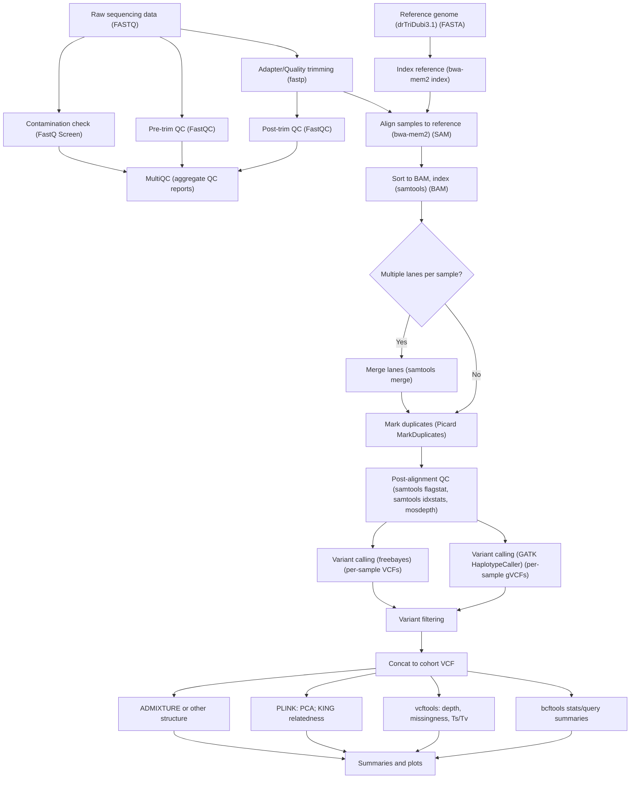

# A population genomics analysis of the shamrock, _Trifolium dubium_, in Ireland.

This repository contains scripts and configurations for the population genomic analysis of _Trifolium dubium_, a small yellow-flowered clover native to western Eurasia and the species most widely recognised as being the **"true shamrock"** ☘️, as part of **TRIDUBIRE** (_**Tri**folium **dub**ium_ genomics **Ire**land) (Website: [Link](https://tridubire.github.io/)).

Whole-genome resequencing (WGS) data from 43 Irish individuals (available under: [PRJEB101895](https://www.ebi.ac.uk/ena/browser/view/PRJEB101895)) were aligned to the _T. dubium_ reference genome ([drTriDubi3.1; GCA_951804385.1](https://www.ncbi.nlm.nih.gov/datasets/genome/GCA_951804385.1/)).

The scripts in this repo produce filtered variant datasets and population genomic summaries to characterise genetic diversity and population structure of the species across Ireland.

**See also the TRIDUBIRE GitHub repo of this analysis: [Link](https://github.com/tridubire/tridubire_analysis)**

## Analysis overview
| Step | Tools | Notes |
| ---- | ----- | ----- |
| 1. Initial QC | FastQC, FastQ Screen, fastp | Clean FASTQs |
| 2. Alignment | bwa-mem2, samtools, picard, mosdepth | Sorted, deduped BAMs |
| 3. Variant Calling | GATK HaplotypeCaller/freebayes | gVCFs / VCFs |
| 4. Filtering | VariantFiltration, bcftools | Filtered, final VCF |
| 5. Post-VCF QC | vcftools, bcftools, PLINK, ADMIXTURE	| QC reports, PCA plots, population summaries |

### Flowchat

These steps are reflected in the output directory structure from running the scripts in this repo:
```bash
├──00-data
├──01-initial_qc
├──02-alignment
├──03-variant_calling
├──04-filtering
├──05-post_vcf_qc
├──configs
└──bin
```

Read files and the reference genome can be downloaded and indexed into `00-data` using `01-setup_qc.sh`. 

The `configs` directory contains additional configuration files, including:
- `directories.sh` - Defines project directories and locations of project-related files
- `containers.sh` - Defines singularity containers used
- `general.sh` - Defines runtime parameters, e.g. threads, memory, singularity run settings
- `samplesheet.csv` - Defines TRIDUBIRE sample information. Used by SRA tools to download read files and throughout as a reference through which to loop through samples

## Environment requirements and set-up
```bash
git clone https://github.com/tridubire/tridubire_analysis.git # Clone repo
cd tridubire_analysis # Be in the project directory
```

## How to run
Assumes user is running on HPC with Singularity and a SLURM scheduler. Run with `sbatch <SCRIPT>.sh` in numerical order.
```bash
# e.g.
sbatch 01-setup_qc.sh
```

| Script                | Description                                             |
| --------------------- | ------------------------------------------------------- |
| `01-setup_qc.sh`      | Download reads (SRA), download reference, build indexes |
| `02-run_qc.sh`        | FastQC, FastQ Screen, trimming (fastp)                  |
| `03-run_alignment.sh` | Align trimmed reads per lane, merge per sample          |
| `04-*`                | Post-alignment QC (mosdepth, summaries)                 |
| `05-*`                | Variant calling                                         |
| `06-*`                | Filtering                                               |
| `07+`                 | Downstream QC and population analyses                   |

Some of these scripts are in the `ARCHIVE`, to be updated to the more reproducible pipeline format as used with scripts `01-setup_qc.sh`, `02-run_qc.sh` and `03-run_alignment.sh`.

## Authors
Katie Herron<sup>1</sup>, Ann M McCartney<sup>1,2</sup>, Graham M Hughes<sup>1</sup>

<sup>1</sup> School of Biological and Environmental Sciences, University College Dublin, Ireland

<sup>2</sup> Genomics Institute, University of California, Santa Cruz, California, USA

## Acknowledgements
This work was supported by the SIB Swiss Institute of Bioinformatics under the Biodiversity Genomics Europe project.

Scripts in this repository available under the terms of the MIT license. See [LICENSE](https://github.com/tridubire/tridubire_analysis?tab=MIT-1-ov-file#readme).
